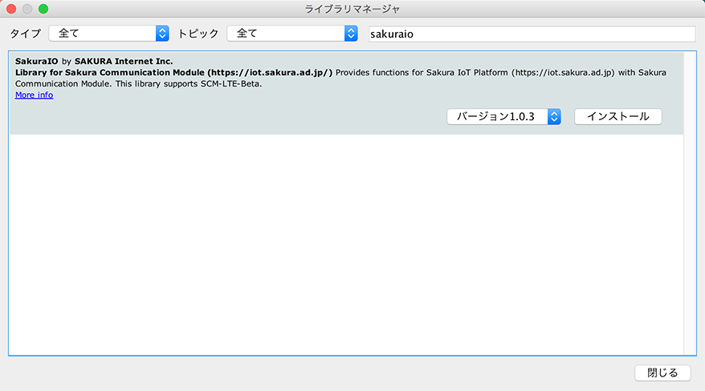

# Sakura Communication Module for sakura.io Library for Arduino 

**Under development**

[Sakura Communication Module](https://sakura.io/product/) (with [sakura.io](https://sakura.io/)) library for Arduino.

[sakura.io](https://sakura.io/) is the IoT platform of SAKURA intenret Inc.

# Support

This library supports following products.

* SCM-LTE-Beta (Sakura Communication Module (LTE) β)
* [SCM-LTE-01 (Sakura Communication Module (LTE))](https://sakura.io/product/module_lte.html)
* SCM-920-Alpha (Sakura Communication Module (LoRa) α)

with

* [SCO-ARD-01 (Arduino Shield for SCM)](https://sakura.io/product/arduino.html)

# Install

## Using the Library Manager (Recommended)

* Open the IDE and click to the `Sketch` menu and then `Include Library` > `Manage Libraries`.
* Input `sakuraio` in search box.
* Click on `Install` and wait for the IDE to install the new library.




## Manual Install

* Download ZIP from [here](https://github.com/sakuraio/SakuraIOArduino/archive/master.zip).
* Place the ZIP file in Arduino `libraries` directory.
  * Mac `~/Documents/Arduino/libraries`
  * Linux The `libraries` folder in your sketchbook
  * Windows `My Documents\Arduino\libraries`


# Reference

Please see the [datasheet](https://sakura.io/developer/pdf/sakura_module_datasheet_latest.pdf).


## Example

Please see more [examples](#examples).

```cpp
#include <SakuraIO.h>

//SakuraIO_SPI sakuraio(10);
SakuraIO_I2C sakuraio;
uint32_t cnt;

void setup(){
  cnt = 0;
  while((sakuraio.getConnectionStatus() & 0x80) != 0x80){
    delay(1000);
  }
}

void loop() {
  cnt++;
  sakuraio.enqueueTx(0,cnt);
  sakuraio.enqueueTx(1,cnt);
  sakuraio.enqueueTx(2,cnt);
  sakuraio.send();
  delay(1000);
}
```


## Constant

```cpp
// Response
#define CMD_ERROR_NONE             0x01
#define CMD_ERROR_PARITY           0x02
#define CMD_ERROR_MISSING          0x03
#define CMD_ERROR_INVALID_SYNTAX   0x04
#define CMD_ERROR_RUNTIME          0x05
#define CMD_ERROR_LOCKED           0x06
#define CMD_ERROR_BUSY             0x07
```

## Methods

```cpp
// Common
uint8_t getConnectionStatus();
uint8_t getSignalQuality();
uint64_t getUnixtime();
uint8_t echoback(uint8_t length, uint8_t *data, uint8_t *response);

// Send
uint8_t enqueueTx(uint8_t ch, int32_t value, uint64_t offset);
uint8_t enqueueTx(uint8_t ch, uint32_t value, uint64_t offset);
uint8_t enqueueTx(uint8_t ch, int64_t value, uint64_t offset);
uint8_t enqueueTx(uint8_t ch, uint64_t value, uint64_t offset);
uint8_t enqueueTx(uint8_t ch, float value, uint64_t offset);
uint8_t enqueueTx(uint8_t ch, double value, uint64_t offset);
uint8_t enqueueTx(uint8_t ch, uint8_t value[8], uint64_t offset);
uint8_t enqueueTx(uint8_t ch, int32_t value);
uint8_t enqueueTx(uint8_t ch, uint32_t value);
uint8_t enqueueTx(uint8_t ch, int64_t value);
uint8_t enqueueTx(uint8_t ch, uint64_t value);
uint8_t enqueueTx(uint8_t ch, float value);
uint8_t enqueueTx(uint8_t ch, double value);
uint8_t enqueueTx(uint8_t ch, uint8_t value[8]);
uint8_t sendImmediatelyRaw(uint8_t ch, uint8_t type, uint8_t length, uint8_t *data, uint64_t offset);
uint8_t sendImmediately(uint8_t ch, int32_t value, uint64_t offset);
uint8_t sendImmediately(uint8_t ch, uint32_t value, uint64_t offset);
uint8_t sendImmediately(uint8_t ch, int64_t value, uint64_t offset);
uint8_t sendImmediately(uint8_t ch, uint64_t value, uint64_t offset);
uint8_t sendImmediately(uint8_t ch, float value, uint64_t offset);
uint8_t sendImmediately(uint8_t ch, double value, uint64_t offset);
uint8_t sendImmediately(uint8_t ch, uint8_t value[8], uint64_t offset);
uint8_t sendImmediately(uint8_t ch, int32_t value);
uint8_t sendImmediately(uint8_t ch, uint32_t value);
uint8_t sendImmediately(uint8_t ch, int64_t value);
uint8_t sendImmediately(uint8_t ch, uint64_t value);
uint8_t sendImmediately(uint8_t ch, float value);
uint8_t sendImmediately(uint8_t ch, double value);
uint8_t sendImmediately(uint8_t ch, uint8_t value[8]);
uint8_t getTxQueueLength(uint8_t *available, uint8_t *queued);
uint8_t clearTx();
uint8_t getTxStatus(uint8_t *queue, uint8_t *immediate);
uint8_t send();

// Reeceive
uint8_t dequeueRx(uint8_t *ch, uint8_t *type, uint8_t *value, int64_t *offset);
uint8_t peekRx(uint8_t *ch, uint8_t *type, uint8_t *value, int64_t *offset);
uint8_t getRxQueueLength(uint8_t *available, uint8_t *queued);
uint8_t clearRx();

// File download
uint8_t startFileDownload(uint16_t fileId);
uint8_t cancelFileDownload();
uint8_t getFileMetaData(uint8_t *status, uint32_t *totalSize, uint64_t *timestamp, uint32_t *crc);
uint8_t getFileDownloadStatus(uint8_t *status, uint32_t *currentSize);
uint8_t getFileData(uint8_t *size, uint8_t *data);

// Operation
uint16_t getProductID();
uint8_t getUniqueID(char *data);
uint8_t getFirmwareVersion(char *data);
uint8_t unlock();
uint8_t updateFirmware();
uint8_t getFirmwareUpdateStatus();
uint8_t reset();
```


# Examples

Please see example code.

* [Standard](./examples/Standard/Standard.ino)
* [File download](./examples/FileDownload/FileDownload.ino)
* [Firmware update](./examples/FirmwareUpdate/FirmwareUpdate.ino)
* [Send temperature and humidity (HDC1000)](./examples/HDC1000/HDC1000.ino) (depends on [hotchpotch/Arduino-HDC1000](https://github.com/hotchpotch/Arduino-HDC1000))
* [Send temperature and humidity (BME280)](./examples/BME280/BME280.ino) (depends on [sparkfun/SparkFun_BME280_Arduino_Library](https://github.com/sparkfun/SparkFun_BME280_Arduino_Library))
* [6-Axis](./examples/GY-521/GY-521.ino)
* [Send human presence](./examples/SB412A/SB412A.ino)
* [Shell](./examples/Shell/Shell.ino)
* [Send illminance (CdS)](./examples/CdS/CdS.ino)

# Notes

* On the Uno and other ATMEGA based boards, Values ​​of type double are sent as float type. (Please see [Arduino Reference]( https://www.arduino.cc/reference/en/language/variables/data-types/double/).)

* Please use SakuraIOUtils::double2float() when you want to handle the value of double type received as float. DO NOT USE C type casting. (Please see [the example](./examples/double2float/double2float.ino))

# License

The MIT License (MIT)

Copyright (c) SAKURA Internet Inc.

Permission is hereby granted, free of charge, to any person obtaining a copy of this software and associated documentation files (the "Software"), to deal in the Software without restriction, including without limitation the rights to use, copy, modify, merge, publish, distribute, sublicense, and/or sell copies of the Software, and to permit persons to whom the Software is furnished to do so, subject to the following conditions:

The above copyright notice and this permission notice shall be included in all copies or substantial portions of the Software.

THE SOFTWARE IS PROVIDED "AS IS", WITHOUT WARRANTY OF ANY KIND, EXPRESS OR IMPLIED, INCLUDING BUT NOT LIMITED TO THE WARRANTIES OF MERCHANTABILITY, FITNESS FOR A PARTICULAR PURPOSE AND NONINFRINGEMENT. IN NO EVENT SHALL THE AUTHORS OR COPYRIGHT HOLDERS BE LIABLE FOR ANY CLAIM, DAMAGES OR OTHER LIABILITY, WHETHER IN AN ACTION OF CONTRACT, TORT OR OTHERWISE, ARISING FROM, OUT OF OR IN CONNECTION WITH THE SOFTWARE OR THE USE OR OTHER DEALINGS IN THE SOFTWARE.
